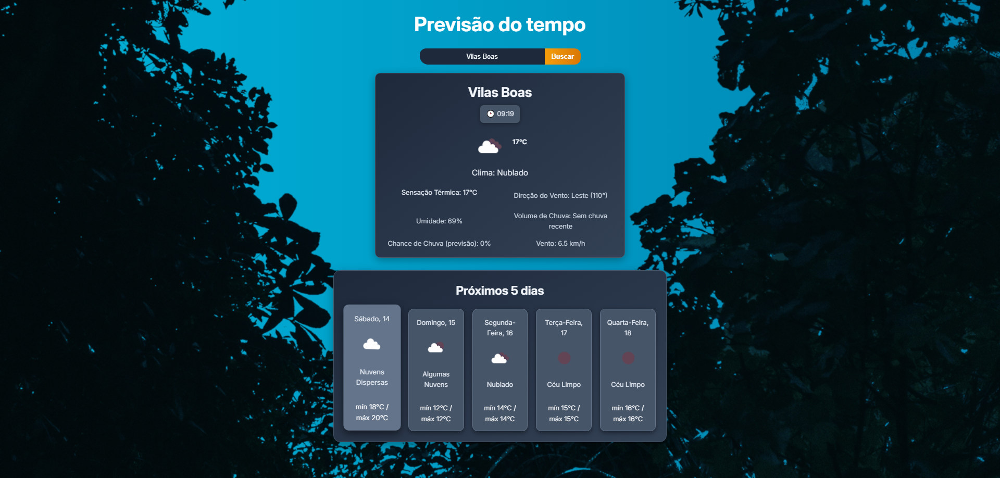

<div align="center">

# ☀️ PrevdoTempo

**Aplicativo web de clima moderno e responsivo, desenvolvido com React + OpenWeatherMap.**

🌙 Interface escura elegante • 📍 Busca por cidade e localização atual • 📆 Previsão para 5 dias • 🎨 Ícones com filtros CSS

---

### 🌤️ Preview da Interface



</div>

---

## 🔍 Funcionalidades

- ☁️ Clima atual: temperatura, sensação térmica e descrição do tempo
- 🌧️ Informações adicionais: umidade, volume de chuva, direção e velocidade do vento
- 📍 Detecção de localização via navegador
- 🧠 Sugestões de cidades com autocomplete
- 📅 Previsão estendida para os próximos 5 dias
- 🌗 Tema escuro com gradientes e visual moderno
- 🎨 Ícones personalizados usando filtros CSS (`hue-rotate`, `brightness`, etc.)

---

## ⚙️ Tecnologias Utilizadas

- [React.js](https://reactjs.org/)
- [Vite](https://vitejs.dev/)
- [OpenWeatherMap API](https://openweathermap.org/api)
- CSS moderno (Flexbox, gradientes, variáveis)
- React Hooks (`useState`, `useEffect`, `useRef`)
- Axios para requisições HTTP

---

## 💻 Instalação Local

```bash
# Clone o repositório
git clone https://github.com/MarcoALR/PrevdoTempo.git

# Acesse a pasta do projeto
cd PrevdoTempo

# Instale as dependências
npm install

# Inicie o servidor de desenvolvimento
npm run dev
